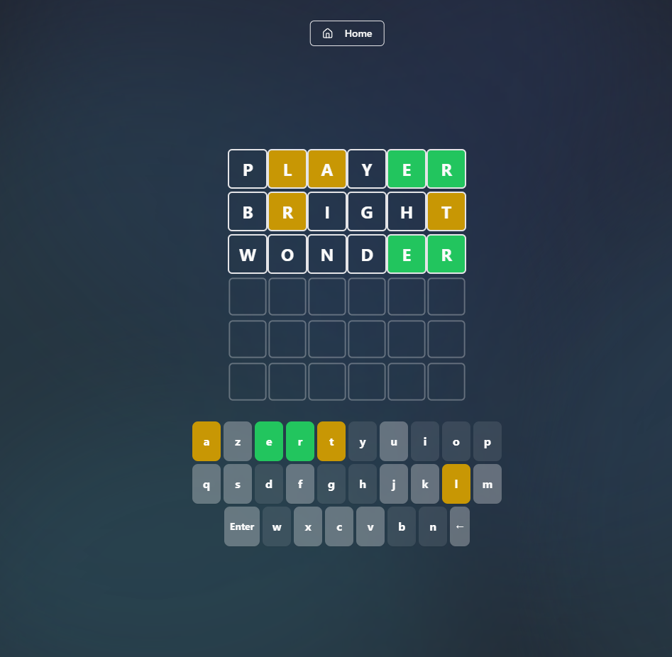

# Lexic - Word Guessing Game



Wordle Clone. Features multilingual support, customizable keyboard layouts, and an elegant user interface.

🎮 [Try Live Demo](https://lexic-kappa.vercel.app)

## ✨ Key Features

- 🌐 Multilingual gameplay (English & French)
- ⌨️ Multiple keyboard layouts (QWERTY/AZERTY)
- 🎨 UI with ambient animations
- 📱 Responsive design 
- 📊 Game statistics
- 🔒 Secure game state management

## 🛠️ Technology Stack

- **Framework:** Next.js 14
- **Language:** TypeScript
- **Styling:** Tailwind CSS
- **Animations:** Framer Motion
- **UI Components:** Radix UI
- **Icons:** Lucide Icons

## 🚀 Getting Started

 **Clone and Install:**
```bash
git clone https://github.com/pasteq7/lexic.git
cd lexic
npm install
```

```bash
npm run dev
```


